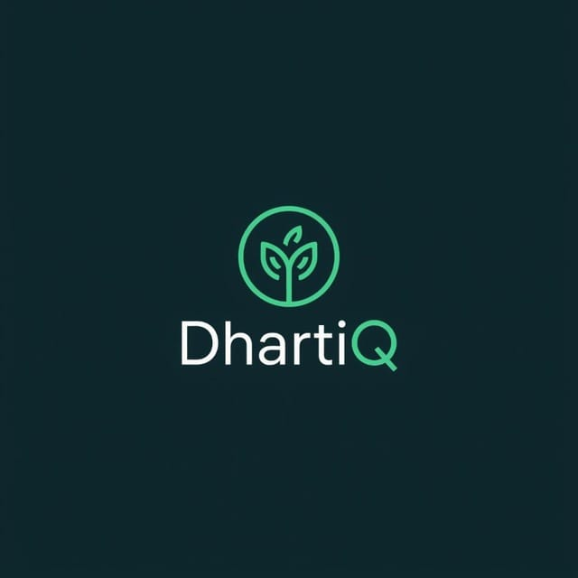
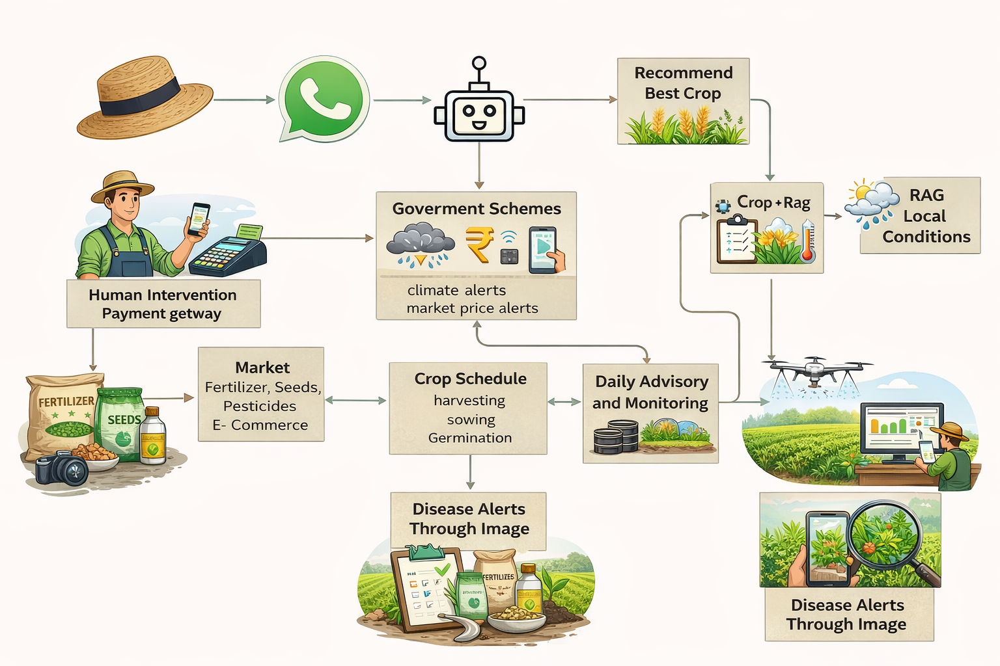
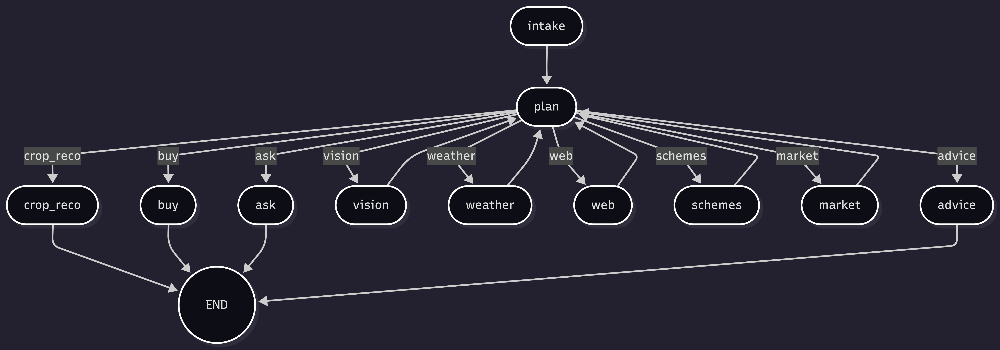

<div align="center">



<br>

# 🌾 DhartiQ

<p><i>An AI-powered, agentic crop advisory system delivering real-time, stage-wise farming guidance built for India's marginal farmers.</i></p>

<br>

[](https://t.me/DhartiQ_bot)

<br>


</div>

&nbsp;

## Table of Contents

| | | |
|:---:|:---:|:---:|
| [Why Agriculture](#why-agriculture) | [Objectives](#objectives) | [Features](#features) |
| [Demo](#demo) | [Architecture and Flow](#architecture-and-flow) | [Tech Stack](#tech-stack) |
| [Project Structure](#project-structure) | [Local Setup](#local-setup) | [Database Setup](#database-setup-mysql-via-xampp) |
| [Run the Bot](#run-the-bot) | [Telegram Commands](#telegram-commands) | [Safety Guardrails](#safety-guardrails) |
| [Future Scope](#future-scope) | [Expected Impact](#expected-impact) | [Authors](#authors) |

&nbsp;

## Why Agriculture

Agriculture is India's backbone and yet its farmers are among the most underserved.

| Metric | Reality |
|:---|:---|
| GDP Contribution | **15–18%** of India's GDP |
| Workforce | **45–50%** of India's population |
| Farmer Loss Causes | Opaque pricing · Limited market access · Scheme unawareness · No localized advisory |

> **Even small, targeted improvements in advisory and market access can create outsized economic impact. That is exactly what DhartiQ delivers.**

&nbsp;

## Objectives

<div align="center">

| # | Objective | Description |
|:---:|:---|:---|
| 01 | **Localized Advisory** | Guidance in native dialects based on soil, weather, crop patterns, and local conditions |
| 02 | **Market Transparency** | Real-time mandi prices, subsidy updates, and scheme info with no middlemen needed |
| 03 | **Lower Access Barriers** | Modern tools and govt benefits delivered via simple channels like WhatsApp / Telegram |

</div>

&nbsp;

## Features

### Advisory Core
- Continuous advisory loop based on **crop + stage + location + symptoms**
- **7 crop stage buttons** : Sowing → Germination → Vegetative → Flowering → Fruiting → Maturity → Harvest
- Flexible location input : city name, coordinates (`lat,lon`), or live GPS via Telegram
- On-demand modules : Govt schemes, market prices, buy inputs, crop suggestions (loaded only when clicked)

### AI Vision : Disease Detection
- Upload a crop photo → AI detects likely issues → Safe, actionable recommendations returned
- Encourages expert review when image clarity is low

### Inclusion and Empowerment
- Government scheme awareness & eligibility guidance
- Subsidy information
- Financial literacy support
- Market linkage support

### Multilingual Support
- Full interaction in **English / हिंदी / मराठी**
- Buttons, prompts, and advisory all translate dynamically

### Price Comparison Bot
- Compares seed / fertilizer / pesticide rates across platforms in real time
- Helps farmers avoid overpricing

### Alerts
- Crop condition change alerts
- Mandi price alerts

&nbsp;

## Demo

<div align="center">
## Make sure telegram is downloaded on your system/phone 
### Live Bot

**[Launch DhartiQ on Telegram →](https://t.me/DhartiQ_bot)**

&nbsp;

### Video Tutorial

[](https://www.youtube.com/watch?v=fsKwvcneShw)

&nbsp;

### Feature GIFs

**Location · Crop Suggestions · Govt Schemes**


&nbsp;

**Govt Schemes · Buy Inputs**


&nbsp;

**Multilingual Support**


</div>

&nbsp;

## Architecture and Flow

### Overall System Flow

<div align="center">



</div>

&nbsp;

### Agentic AI : Multi-Level Agent Flow

<div align="center">



</div>

&nbsp;

### How It Works

```
User (Telegram)
      │
      ▼
┌─────────────────┐     ┌──────────────────┐
│  Telegram Bot   │────▶│  LangGraph Agent  │
│  (UI + Routing) │     │  (Orchestration)  │
└─────────────────┘     └────────┬─────────┘
                                 │
           ┌─────────────────────┼─────────────────────┐
           ▼                     ▼                     ▼
   ┌───────────┐       ┌─────────────┐       ┌─────────────┐
   │ OpenAI    │       │  OpenWeather│       │   Tavily    │
   │ GPT-4.1   │       │  (Weather)  │       │  (Search)   │
   │ (Advisory │       │  + Fallback │       │  Schemes /  │
   │  + Vision)│       └─────────────┘       │  Prices /   │
   └───────────┘                             │  Links      │
                                             └─────────────┘
           │
           ▼
   ┌───────────┐
   │  MySQL    │
   │ (Profiles │
   │  Sessions │
   │  Images)  │
   └───────────┘
```

&nbsp;

## Tech Stack

<div align="center">

| Layer | Technology | Role |
|:---|:---|:---|
| Agent Orchestration | **LangGraph** | Workflow routing + state management |
| LLM | **OpenAI GPT-4.1-mini** | Advisory generation + image diagnosis |
| Weather | **OpenWeather** (One Call 3.0) | Real-time weather context with auto-fallback |
| Search | **Tavily API** | Live web search for schemes, prices, buy links |
| Database | **MySQL (XAMPP)** | Persistent profiles, sessions, image records |
| UI | **Telegram Bot API** | Rich inline buttons + multilingual interface |
| Language | **Python 3.10+** | Core application runtime |

</div>

&nbsp;

## Project Structure

```
agentic_crop_advisor/
│
├── run.py                   # Entry point, starts the Telegram bot (polling)
├── requirements.txt         # Python dependencies
├── .env.example             # Environment variable template
├── .gitignore
├── README.md
│
└── src/
    └── app/
        ├── __init__.py
        ├── config.py        # App configuration & env loading
        ├── models.py        # Data models / schemas
        ├── tools.py         # Agentic AI tools (weather, search, vision)
        ├── db.py            # Database helpers & schema management
        ├── store.py         # State store layer
        ├── graph.py         # LangGraph agents + orchestration (core logic)
        └── telegram_bot.py  # Telegram bot handlers & UI
```

> **Where the agents live** → `src/app/graph.py` contains all LangGraph orchestration and node logic.

&nbsp;

## Local Setup

### Step 1 : Clone and Create Virtual Environment

```bash
git clone https://github.com/Bit-Bard/404_Not_Found_Agriculture.git
cd agentic_crop_advisor

python -m venv .venv

# Windows
.venv\Scripts\activate

# Mac / Linux
source .venv/bin/activate
```

### Step 2 : Install Dependencies

```bash
pip install -r requirements.txt
```

### Step 3 : Configure Environment Variables

```bash
# Windows
copy .env.example .env

# Mac / Linux
cp .env.example .env
```

Open `.env` and fill in your keys:

| Variable | Description |
|:---|:---|
| `TELEGRAM_BOT_TOKEN` | Your Telegram bot token |
| `OPENAI_API_KEY` | OpenAI API key |
| `OPENAI_MODEL` | Model name (default: `gpt-4.1-mini`) |
| `OPENAI_BASE_URL` | *(Optional)* Custom base URL |
| `TAVILY_API_KEY` | Tavily search API key |
| `TAVILY_MAX_RESULTS` | Max search results (default: `5`) |
| `OPENWEATHER_API_KEY` | OpenWeather API key |
| `OPENWEATHER_UNITS` | Units (default: `metric`) |
| `MYSQL_HOST` | MySQL host (default: `127.0.0.1`) |
| `MYSQL_PORT` | MySQL port (default: `3306`) |
| `MYSQL_USER` | MySQL username (default: `root`) |
| `MYSQL_PASSWORD` | MySQL password |
| `MYSQL_DB` | Database name: `agentic_crop_advisor` |
| `DIGEST_INTERVAL_SECONDS` | Digest interval (default: `86400` = 24h) |
| `DIGEST_FIRST_DELAY_SECONDS` | First digest delay (default: `10`) |

> **Note:** OpenWeather One Call 3.0 may return `401` if your plan does not support it. The system automatically falls back to One Call 2.5 and `/weather`.

&nbsp;

## Database Setup (MySQL via XAMPP)

### Step 1 : Start MySQL

Open **XAMPP Control Panel** → Click **Start** next to MySQL.

### Step 2 : Create Database

```sql
CREATE DATABASE agentic_crop_advisor;
```

### Step 3 : Create Tables

```sql
-- Farmers (profile)
CREATE TABLE IF NOT EXISTS farmers (
  id               BIGINT        PRIMARY KEY AUTO_INCREMENT,
  chat_id          VARCHAR(64)   NOT NULL UNIQUE,
  farmer_name      VARCHAR(120)  NULL,
  crop             VARCHAR(64)   NULL,
  stage            VARCHAR(32)   NULL,
  land_size        DECIMAL(10,2) NULL,
  land_unit        VARCHAR(16)   NULL,
  location_text    VARCHAR(255)  NULL,
  lat              DECIMAL(9,6)  NULL,
  lon              DECIMAL(9,6)  NULL,
  language         VARCHAR(8)    NOT NULL DEFAULT 'en',
  created_at_utc   DATETIME      NOT NULL,
  updated_at_utc   DATETIME      NOT NULL
);

-- Sessions (graph state persistence)
CREATE TABLE IF NOT EXISTS sessions (
  id               BIGINT        PRIMARY KEY AUTO_INCREMENT,
  chat_id          VARCHAR(64)   NOT NULL UNIQUE,
  state_json       LONGTEXT      NOT NULL,
  updated_at_utc   DATETIME      NOT NULL
);

-- Images (upload history)
CREATE TABLE IF NOT EXISTS images (
  id               BIGINT        PRIMARY KEY AUTO_INCREMENT,
  chat_id          VARCHAR(64)   NOT NULL,
  file_path        VARCHAR(512)  NOT NULL,
  telegram_file_id VARCHAR(256)  NULL,
  caption          TEXT          NULL,
  created_at_utc   DATETIME      NOT NULL,
  INDEX idx_images_chat_id (chat_id)
);
```

> If `db.py` auto-creates tables on startup, this schema still serves as a handy reference.

&nbsp;

## Run the Bot

```bash
python run.py
```

On successful start, you will see:

```
Telegram polling started
Incoming messages handled
Weather / Tavily / OpenAI calls executing
```

&nbsp;

## Telegram Commands

| Command | Action |
|:---|:---|
| `/start` | Welcome screen → ask location → show main controls |
| `/help` | Full usage guide |
| `/profile` | View / set your farmer profile |
| `/location` | Show "Share Location" button |
| `/reset` | Reset user session state |

### Interactive Buttons

| Category | Options |
|:---|:---|
| **Language** | English · हिंदी · मराठी |
| **Crop Stage** | Sowing · Germination · Vegetative · Flowering · Fruiting · Maturity · Harvest |
| **Actions** | Set Profile · Update Location · Report Symptoms · Crop Suggestions · Buy Inputs · Govt Schemes · Market Prices |

### Typical Farmer Flow

```
1. /start
2. Share GPS location   OR type: "Pune, Maharashtra" / "18.52, 73.85"
3. Share profile:
       My name is Ramesh
       Crop: rice
       Stage: germination
       Land: 2 acres
4. Report an issue      Type symptoms  OR  upload a photo
5. Tap buttons anytime  Schemes / Market Prices / Buy Inputs
```

&nbsp;

## Safety Guardrails

| Rule | Why |
|:---|:---|
| No pesticide dosage or mixing ratios | Prevents misuse; safety is non-negotiable |
| Advice stays concise & practical | Reduces confusion for low-literacy users |
| Expert review encouraged | Triggered when image clarity or confidence is low |

&nbsp;

## Future Scope

| Feature | Description |
|:---|:---|
| **IoT Integration** | Real-time soil moisture, crop health & environmental sensors |
| **Community Hub** | Peer-to-peer knowledge sharing in local dialects |
| **Micro-Finance & Insurance** | Instant crop loans, weather-based insurance claims |
| **Personalized RAG** | Farmer-specific knowledge base from local data + past conversations |
| **Voice Interface** | Voice-based interaction for low-literacy & hands-free use |

&nbsp;

## Expected Impact

<div align="center">

| Impact Area | Outcome |
|:---|:---|
| Farmer Reach | Empowers **86%** of Indian farmers with scientific, real-time advisory |
| Yield Improvement | Boosts yields by **20–30%**, cuts input costs |
| Financial Stability | Reduces dependency on unreliable middlemen |
| Resource Optimization | Promotes optimal use of fertilizers, pesticides & irrigation |
| Risk Management | Reduces crop failure and loan defaults |

</div>

&nbsp;

## Authors

<div align="center">

Built with ❤️ by **Dhruv Devaliya** & **Yash Raj**

<br>

| | Dhruv Devaliya | Yash Raj |
|:---|:---:|:---:|
| **GitHub** | [](https://github.com/Bit-Bard) | [](https://github.com/KING-OF-FLAME) |
| **LinkedIn** | [](http://www.linkedin.com/in/dhruv-devaliya) | [](https://www.linkedin.com/in/yash-developer/) |
| **Instagram** | [](https://www.instagram.com/ohh.dhruvv_/) | [](https://instagram.com/yash.developer) |

</div>

&nbsp;

<div align="center">

🌾 **DhartiQ** — Because every farmer deserves smart guidance, in their own language, at their fingertips.

<br>
## DhartiQ : multilingual AI farming assistant” that not only advises but also learns, compares, monitors, alerts, and connects farmers to markets an end-to-end ecosystem rather than just an advisory tool.”

</div>
